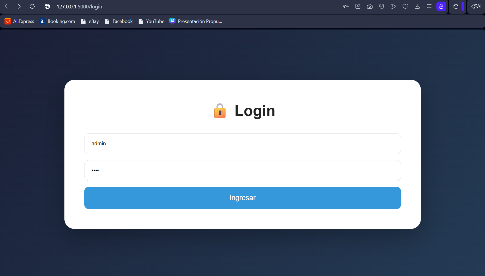
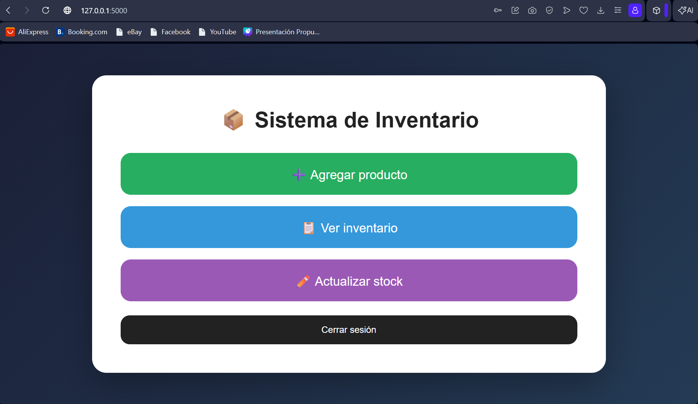
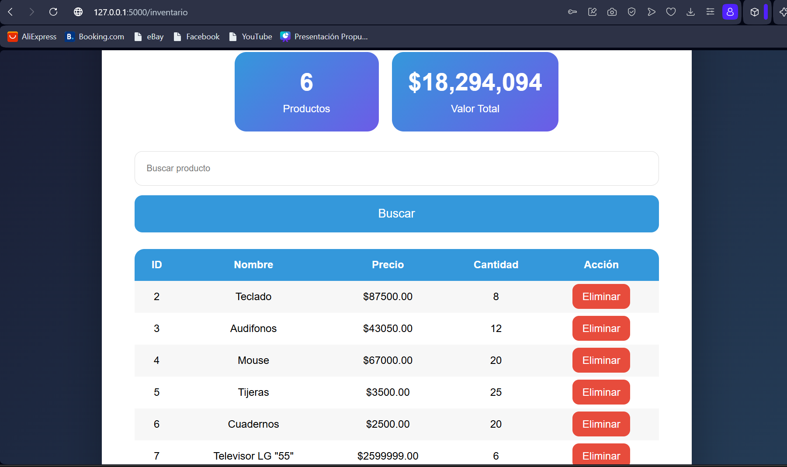

# Sistema de Inventario Web

Aplicación desarrollada con Python, Flask y MySQL.

Sistema con autenticación de administrador para gestionar inventario.

---

## Funcionalidades

- 🔐 Login administrador
- ➕ Agregar productos
- 📋 Ver inventario
- 🔎 Buscar productos
- ✏️ Actualizar stock
- ❌ Eliminar productos
- 📊 Estadísticas

---

## Tecnologías

- Python 3.13
- Flask
- MySQL
- HTML
- CSS

---

## Instalación

Clonar:

```bash
git clone URL
```

Instalar:

```bash
pip install -r requirements.txt
```

Ejecutar:

```bash
python app.py
```

Abrir:

```plaintext
http://127.0.0.1:5000
```
## Capturas

### Login



---

### Menú principal



---

### Inventario


---
Usuario: admin

Contraseña: 1234

Desarrollado por Tomas Bonilla.
